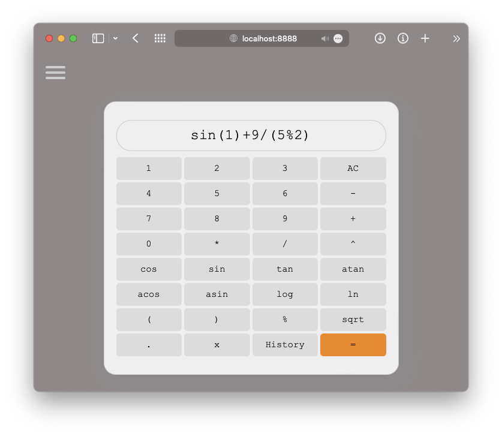

Documentation SmartCalc
=============================

## Build & Run:
```bash
$ cd src
$ make run
```

Main Calculator
---------------

Smart calculator - divided into three blocks. This calculator - calculates arithmetic and binary operations with numbers, graph builder - builds a graph according to a given expression, credit calculator - has two types of credit: annuity, differentiated.



### HOW TO USE:

All buttons of the screen are active.The calculation of the expression you entered is done by pressing the "=" button.When you enter x and press =, a dialog box will appear and ask you to drive the number to replace x.

### Operators


| Operator name | Operator | Description | Example |
| --- | --- | --- | --- |
| Bracket | ( ) | Takes the expression in brackets | x - (y * z) |
| Plus | + | Addition of two operands | x + y |
| Minus | - | The difference of two operands | x - y |
| Multiplication | * | Product of two operands | x * y |
| Division | / | Division of two operands | x / y |
| Exponentiation | ^ | Exponentiation | x ^ y |
| Remainder of division | mod | Remainder of division | x mod y |
| Unary minus | - | Unary minus | -x |
| Unary plus | + | Unary plus | +a |

### Functions

| Function | Description |
| --- | --- |
| cos(x) | Computes cosine |
| sin(x) | Computes sine |
| tan(x) | Computes tangent |
| acos(x) | Computes arc cosine |
| asin(x) | Computes arc sine |
| atan(x) | Computes arc tangent |
| sqrt(x) | Computes square root |
| ln(x) | Computes natural logarithm |
| log(x) | Computes common logarithm |


Credit Calculator
-----------------

### Loan Calculator - calculates your loan. It has two types of credit: annuity, differentiated.


### HOW TO USE:

At the entrance there are three parameters: the loan amount, term for which the loan is taken (in months), the interest rate, in accordance with these parameters and depending on the type of credit you selected, your repayment plan will be calculated.

